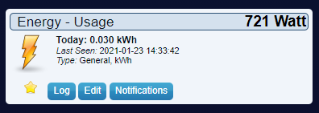
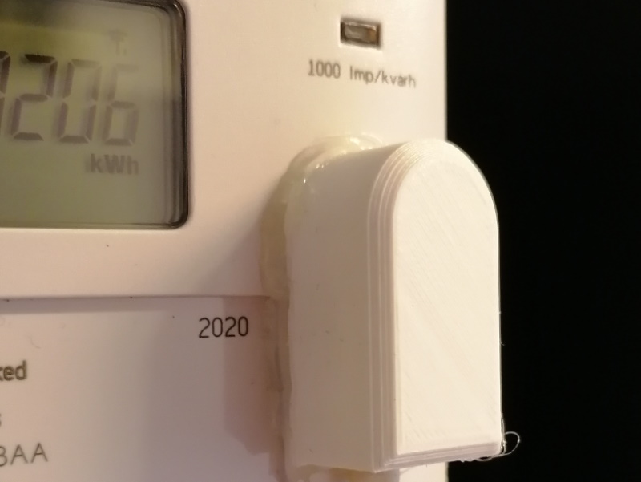
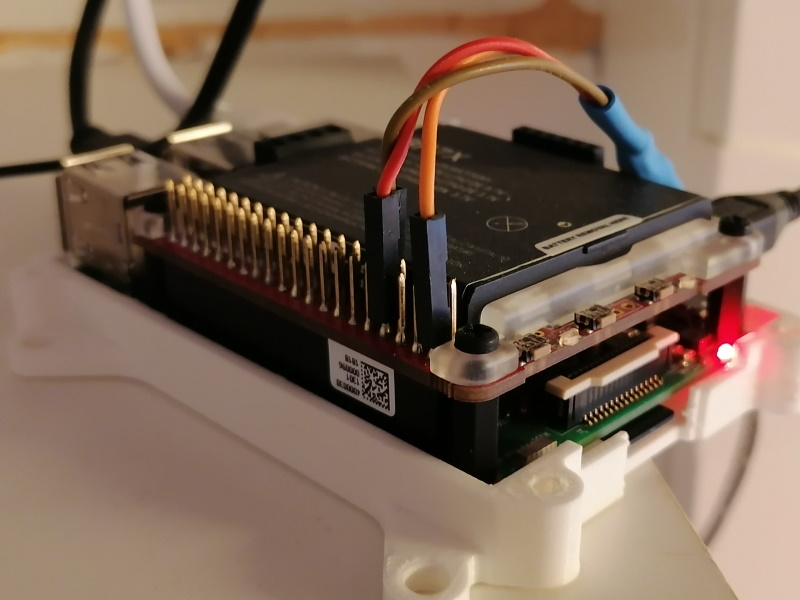
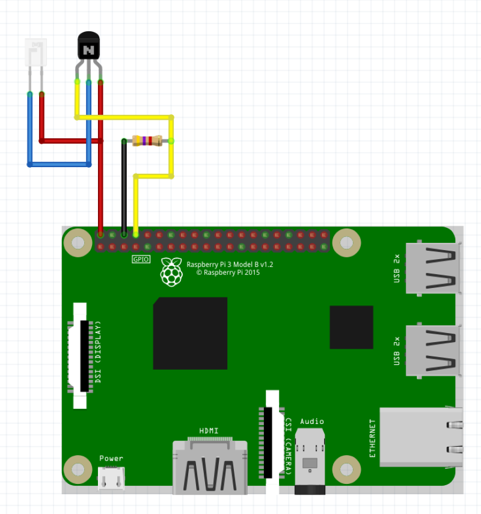

# Domoticz-Energy-Meter-LED-Puls-Counter
Domoticz plugin for counting LED pulses on your energy meter using a pin on the GPIO port.

## Requirements
- LED detector connected to the GPIO port of the raspberry pi that Domoticz is running on.

## Installation
```bash
cd ~/domoticz/plugins
git clone https://github.com/derenback/Domoticz-Energy-Meter-LED-Puls-Counter.git
sudo apt install python3-rpi.gpio
sudo systemctl restart domoticz
```
- Make sure to have the setting "Accept new Hardware Devices" turned on for new devices to be added when adding the Hardware in domoticz.

## Update
```bash
cd ~/domoticz/plugins/Domoticz-Energy-Meter-LED-Puls-Counter
git pull
sudo systemctl restart domoticz
```

## Tested on
- Domoticz version: 2020.2 (build 11997)
- Meter, Network Energy Service type 83334-3IKBAA (Bi-directional) and 83330-3IHA (Single direction) from Eon

## Version history
    0.0.2 Restore pulse count on restart
    0.0.1 Initial version

## Images

### Sensor in Domoticz



### LED Detector connected to meter with hot glue



STL file [here](STL/LEDDetectorHead.stl)

### LED Connected to the Raspberry pi






